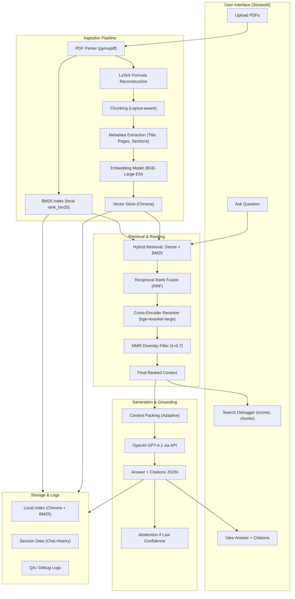

```mermaid

flowchart TD
    subgraph U["User Interface (Streamlit)"]
        A1["Upload PDFs"]
        A2["Ask Question"]
        A3["View Answer + Citations"]
        A4["Search Debugger (scores, chunks)"]
    end

    subgraph I["Ingestion Pipeline"]
        B1["PDF Parser (pymupdf)"]
        B2["LaTeX Formula Reconstruction"]
        B3["Chunking (Layout-aware)"]
        B4["Metadata Extraction (Title, Pages, Sections)"]
        B5["Embedding Model (BGE-Large-EN)"]
        B6["Vector Store (Chroma)"]
        B7["BM25 Index (local rank_bm25)"]
    end

    subgraph R["Retrieval & Ranking"]
        C1["Hybrid Retrieval: Dense + BM25"]
        C2["Reciprocal Rank Fusion (RRF)"]
        C3["Cross-Encoder Reranker (bge-reranker-large)"]
        C4["MMR Diversity Filter (λ=0.7)"]
        C5["Final Ranked Context"]
    end

    subgraph G["Generation & Grounding"]
        D1["Context Packing (Adaptive)"]
        D2["OpenAI GPT-4.1 via API"]
        D3["Answer + Citations JSON"]
        D4["Abstention if Low Confidence"]
    end

    subgraph S["Storage & Logs"]
        E1["Local Index (Chroma + BM25)"]
        E2["Session Data (Chat History)"]
        E3["QA / Debug Logs"]
    end

    %% User Flows
    A1 --> B1 --> B2 --> B3 --> B4 --> B5 --> B6
    B1 --> B7
    A2 --> C1
    C1 --> C2 --> C3 --> C4 --> C5
    C5 --> D1 --> D2 --> D3 --> A3
    D3 --> D4
    C5 --> A4
    B6 --> C1
    B7 --> C1
    D3 --> S
    B6 --> S
    B7 --> S
    
```