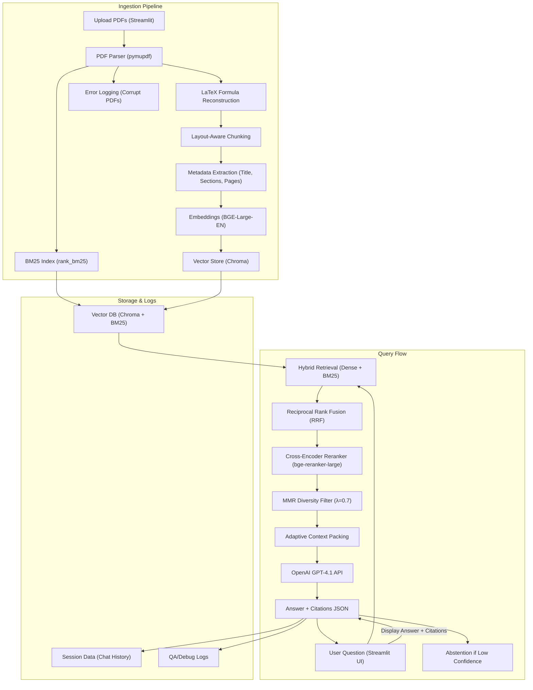

```mermaid


flowchart TD
    %% Ingestion pipeline
    subgraph IN["Ingestion Pipeline"]
        A1["Upload PDFs (Streamlit)"]
        A2["PDF Parser (pymupdf)"]
        A3["LaTeX Formula Reconstruction"]
        A4["Layout-Aware Chunking"]
        A5["Metadata Extraction (Title, Sections, Pages)"]
        A6["Embeddings (BGE-Large-EN)"]
        A7["BM25 Index (rank_bm25)"]
        A8["Vector Store (Chroma)"]
        A9["Error Logging (Corrupt PDFs)"]
    end

    %% Retrieval & generation pipeline
    subgraph QF["Query Flow"]
        B1["User Question (Streamlit UI)"]
        B2["Hybrid Retrieval (Dense + BM25)"]
        B3["Reciprocal Rank Fusion (RRF)"]
        B4["Cross-Encoder Reranker (bge-reranker-large)"]
        B5["MMR Diversity Filter (λ=0.7)"]
        B6["Adaptive Context Packing"]
        B7["OpenAI GPT-4.1 API"]
        B8["Answer + Citations JSON"]
        B9["Abstention if Low Confidence"]
    end

    %% Storage & logs
    subgraph ST["Storage & Logs"]
        C1["Vector DB (Chroma + BM25)"]
        C2["Session Data (Chat History)"]
        C3["QA/Debug Logs"]
    end

    %% Ingestion flow
    A1 --> A2 --> A3 --> A4 --> A5 --> A6 --> A8
    A2 --> A7
    A2 --> A9
    A7 --> C1
    A8 --> C1

    %% Query flow
    B1 --> B2
    B2 --> B3 --> B4 --> B5
    B5 --> B6 --> B7 --> B8
    B8 --> B9
    B8 --> C2
    B8 --> C3
    C1 --> B2
    B8 --> B1

    %% UI output
    B1 -->|Display Answer + Citations| B8


```