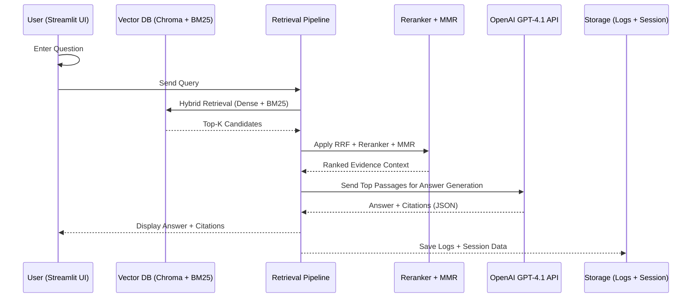

```mermaid


sequenceDiagram
    participant U as User (Streamlit UI)
    participant V as Vector DB (Chroma + BM25)
    participant R as Retrieval Pipeline
    participant L as Reranker + MMR
    participant G as OpenAI GPT-4.1 API
    participant S as Storage (Logs + Session)

    %% User starts interaction
    U->>U: Enter Question
    U->>R: Send Query

    %% Retrieval stage
    R->>V: Hybrid Retrieval (Dense + BM25)
    V-->>R: Top-K Candidates

    %% Reranking stage
    R->>L: Apply RRF + Reranker + MMR
    L-->>R: Ranked Evidence Context

    %% Generation stage
    R->>G: Send Top Passages for Answer Generation
    G-->>R: Answer + Citations (JSON)

    %% UI & Logging
    R-->>U: Display Answer + Citations
    R-->>S: Save Logs + Session Data


```